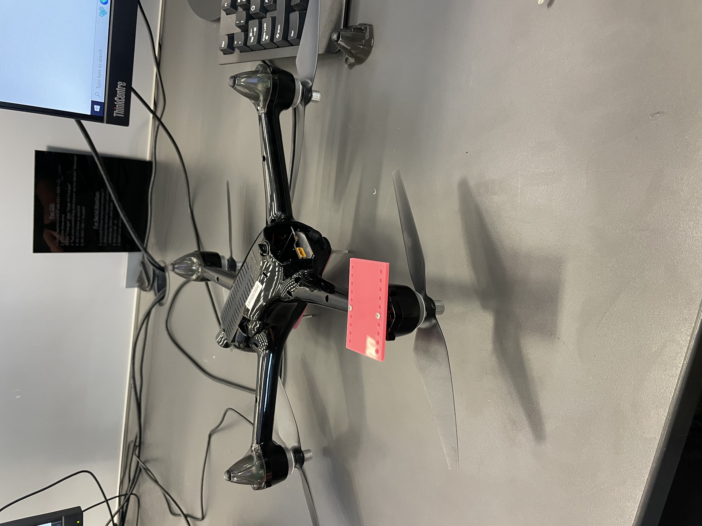
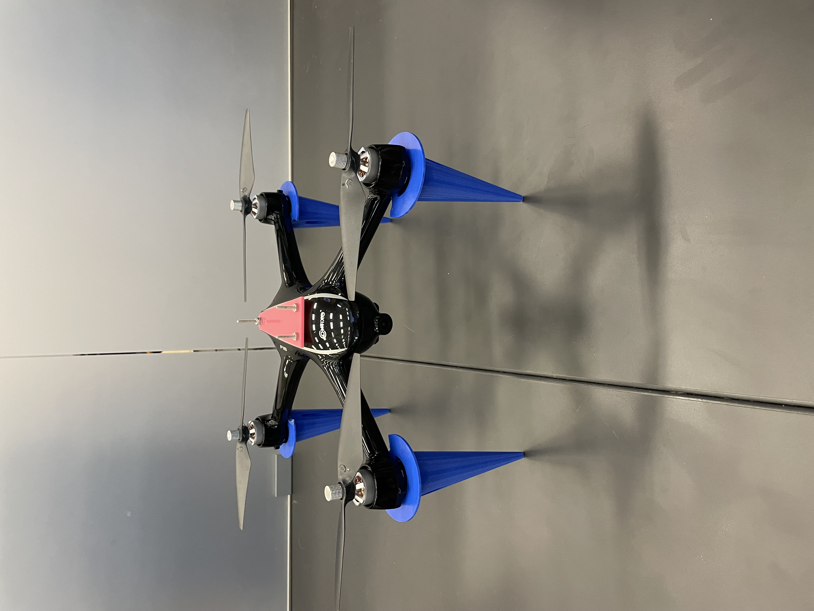
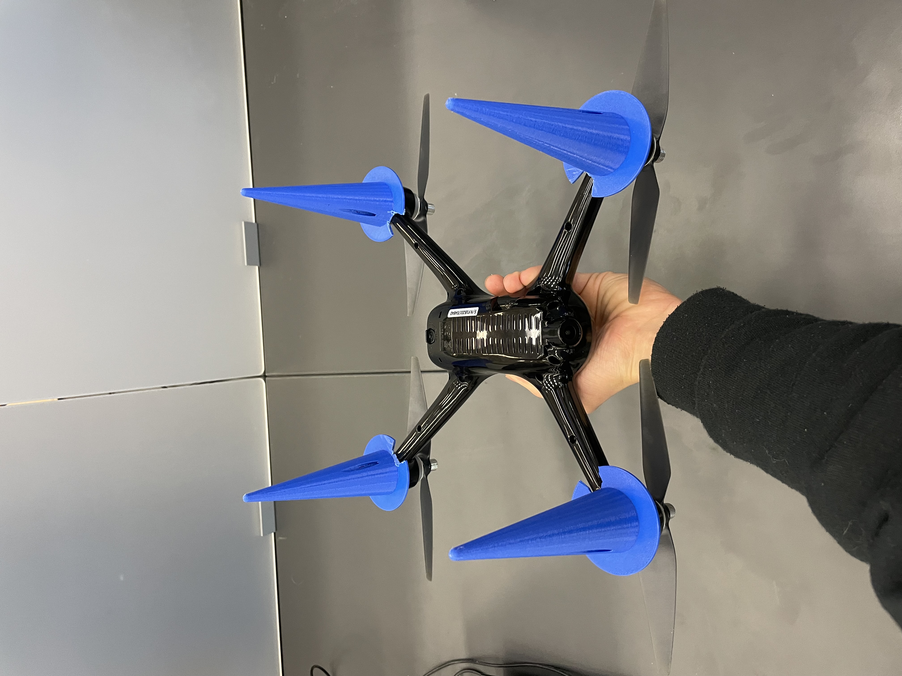
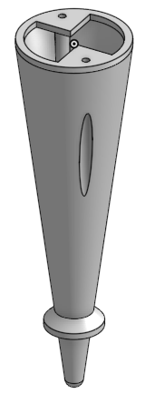
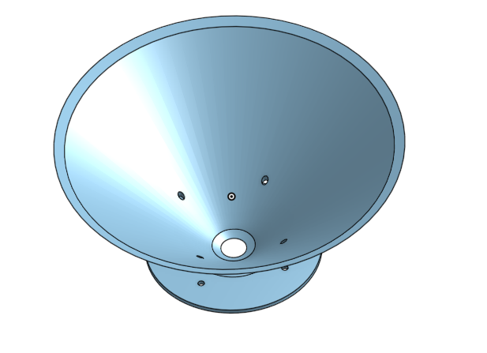
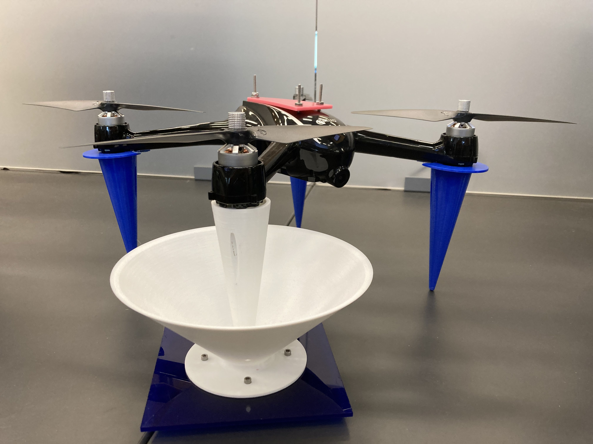
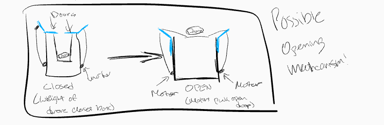
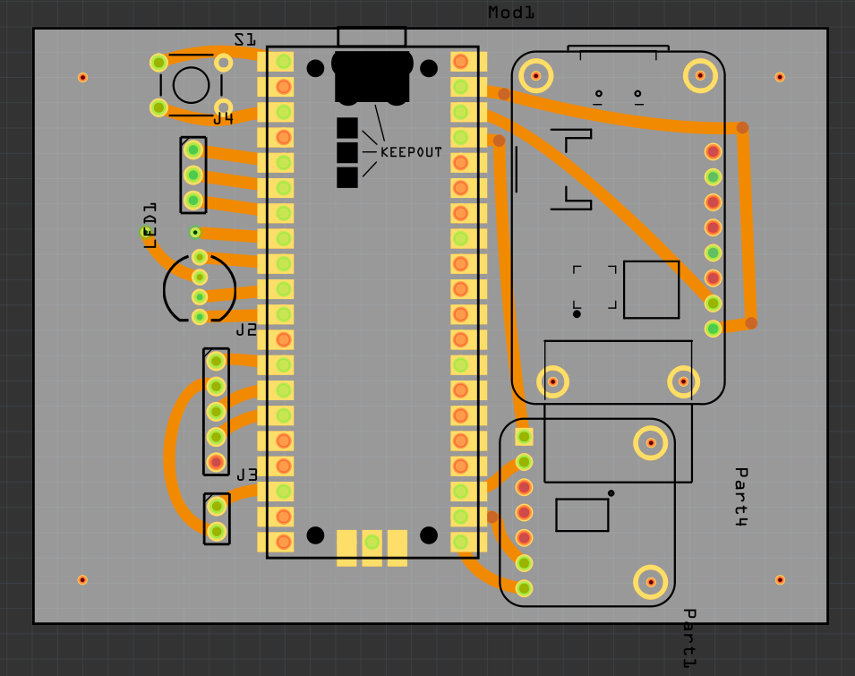

# WindCapstone
2022-2023 Capstone Engineering Project. 

## Table of Contents
* [Scheduled work](#documentation)
* [Code](#Code)

### Task:
Use cumulative knowledge to solve an important issue.

# Resources<ln>

* [Autonomous drone landing](https://www.suasnews.com/2018/09/mapturedrone-in-a-box-prototype-automated-take-off-and-landing-demonstration/)
* [Wind measuring Drone](optolution.com/en/news/single-view-en/optokopter/)

## Materials
* [Modern Device Wind Sensor Rev. P](https://moderndevice.com/products/Wind-Sensor-Rev-P)
* Contixo GPS F18 Drone

## Risk Mitigation
* The main source of risk for our project is drone flight, so we will use proper precautions and only fly in appropriate circumstances

# To-Do
* 

## Tentative schedule
* November 1st - December 20th:
    * Make Onshape model of box
    * Get any sort of wind speed readings (not on a drone)
* January 6th - April 1st:
    * Have box made
    * Have drone fly with full payload
    * Have prototype for charging system
* April - End of School:
    * Have charging system
    * Be able to detect wind speeds accurately
    * Make project summary presentation

# Code

# Documentation

### Week of 10.31.22
* Succesfully pivoted to new project
* Created slideshow
* Developed plan for deliverables and figured out essential vs nonessential requirements
* Relatively sure we will be purchasing the [Modern Device Wind Sensor Rev. P](https://moderndevice.com/products/Wind-Sensor-Rev-P), though getting enough power to it could be a challenge
* Next we will figure out how to connect the Rasperry Pi to the drone

### Week of 11.07.22
* Ordered wind hot wire anemometer sensor
*   Researched anemometer calibration on the [maker's website](https://moderndevice.com/blogs/documentation/wind-sensor-calibration-and-the-wind-tunnel), it is somewhat complicated and may be inaccurate in extreme weather conditions
* Tested how much the Tello drones can lift
* Realized that we will have to use another drone with GPS stabilization since it would be very difficult to correct for the drone's drifting in the wind

### Week of 11.14.22
* Test flew a couple drones, realized that we will use Will's Contixo F18 GPS since has a greater lift capacity and can use GPS to stay in one position in the wind
* Took apart Contixo F18 GPS and figured out that we can drill into the top part of the drone and attach components with bolts
* We will use a template to measure where to drill the holes

### Week of 11.21.22
* Short week, but we got the template plate for making holes in the drone to bolt the wind sensor and other components to
* Drilled the holes and put bolts through the top plate of the drone

### Week of 11.28.22
* Laser cut acrylic plate to find tolerance for holes for leg mounts - will be used in future to make legs
   
* Tested how accurately we can land the drone, found that we can consistently land within an 18" square
* Thought through how our docking will work, we will now prototype a system where the drone will have four legs which will be guided into place by four funnels, alligning the drone

### Week of 12.5.22
* Printed out drone legs and attached them:  
   
* Ran into some clearence issues so had to dremel out a small portion of the legs. 
* Drone flew well and legs seemed to add negligible weight.
* Wrote test code to read wind speed and tempereature from wind sensor, altitude and tempereature from barometric pressure sensor
* Figured out how to record data on the Pico, it requires changing the read/write status of the Pico meaning the computer can no longer write and can only read
   
### Week of 12.12.22
* Created new legs that work well with the drone and will allow for access to charging in the future
    
* Developed funnel for legs to slot into.
    
* Printed one leg and funnel and succesfully tested landing in it
    
* Moved towards finalizing Pico code, we can now save the wind speed, temperature, and altitude to a file; this took a lot of troubleshooting to get the file to save properly

### Week of 1.2.23
* Attached new legs to the drone and attached funnels to a large plate.
* Succesfully tested landing in the funnels
* Finalized a first version of code which can record wind speed, temperature, and altitude
* Started planning the design of the box which will house our drone
    

### Week of 1.9.23
* Determined height needed for the mast for the drone
* Created temporary stand in Onshape for holding up the wind sensor above the drone
* Re-learned how to mill out a circuit board
* Finished designing PCB in Fritzing and prepared G-Code to mill it
    
* G-Code part names and uses
   * T501 - "Contour", V bit for engraving PCB
   * T112 - "Hatches", "cut", milling out all extra copper and profile
   * T609 - "Drill", Drills out the through holes

### Week of 1.16.23
* Worked on presentation describing the current state of our project and our progress during the second quarter

### Week of 1.23.23
* Tried to mill our PCB, but ran into issues with the G-Code created by Carbide Copper having extra tool changes that caused the bit to stop spinning and break, issues with zeroing the z-axis and with the consistency of the width of the copper layer
