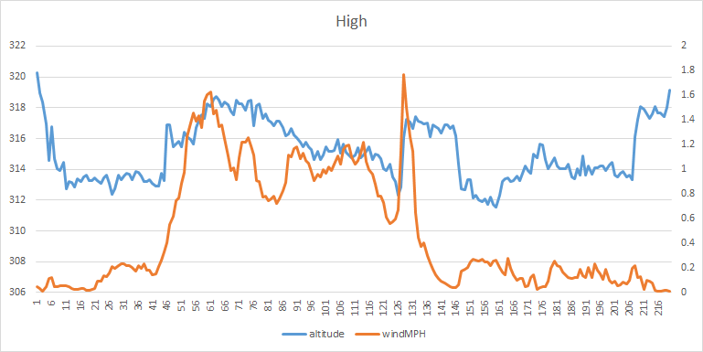

# WindCapstone
2022-2023 Capstone Engineering Project. 

## Table of Contents
* [Scheduled work](#documentation)
* [Code](#Code)

### Task:
Use cumulative knowledge to solve an important issue.

# Resources<ln>

* [Autonomous drone landing](https://www.suasnews.com/2018/09/mapturedrone-in-a-box-prototype-automated-take-off-and-landing-demonstration/)
* [Wind measuring Drone](optolution.com/en/news/single-view-en/optokopter/)

## Materials
* [Modern Device Wind Sensor Rev. P](https://moderndevice.com/products/Wind-Sensor-Rev-P)
* Contixo GPS F18 Drone

## Risk Mitigation
* The main source of risk for our project is drone flight, so we will use proper precautions and only fly in appropriate circumstances

# To-Do
* 

## Tentative schedule
* November 1st - December 20th:
    * Make Onshape model of box
    * Get any sort of wind speed readings (not on a drone)
* January 6th - April 1st:
    * Have box made
    * Have drone fly with full payload
    * Have prototype for charging system
* April - End of School:
    * Have charging system
    * Be able to detect wind speeds accurately
    * Make project summary presentation

# Code

# Documentation

### Week of 10.31.22
* Succesfully pivoted to new project
* Created slideshow
* Developed plan for deliverables and figured out essential vs nonessential requirements
* Relatively sure we will be purchasing the [Modern Device Wind Sensor Rev. P](https://moderndevice.com/products/Wind-Sensor-Rev-P), though getting enough power to it could be a challenge
* Next we will figure out how to connect the Rasperry Pi to the drone

### Week of 11.07.22
* Ordered wind hot wire anemometer sensor
*   Researched anemometer calibration on the [maker's website](https://moderndevice.com/blogs/documentation/wind-sensor-calibration-and-the-wind-tunnel), it is somewhat complicated and may be inaccurate in extreme weather conditions
* Tested how much the Tello drones can lift
* Realized that we will have to use another drone with GPS stabilization since it would be very difficult to correct for the drone's drifting in the wind

### Week of 11.14.22
* Test flew a couple drones, realized that we will use Will's Contixo F18 GPS since has a greater lift capacity and can use GPS to stay in one position in the wind
* Took apart Contixo F18 GPS and figured out that we can drill into the top part of the drone and attach components with bolts
* We will use a template to measure where to drill the holes

### Week of 11.21.22
* Short week, but we got the template plate for making holes in the drone to bolt the wind sensor and other components to
* Drilled the holes and put bolts through the top plate of the drone

### Week of 11.28.22
* Laser cut acrylic plate to find tolerance for holes for leg mounts - will be used in future to make legs
   
* Tested how accurately we can land the drone, found that we can consistently land within an 18" square
* Thought through how our docking will work, we will now prototype a system where the drone will have four legs which will be guided into place by four funnels, alligning the drone

### Week of 12.5.22
* Printed out drone legs and attached them:  
   
* Ran into some clearence issues so had to dremel out a small portion of the legs. 
* Drone flew well and legs seemed to add negligible weight.
* Wrote test code to read wind speed and tempereature from wind sensor, altitude and tempereature from barometric pressure sensor
* Figured out how to record data on the Pico, it requires changing the read/write status of the Pico meaning the computer can no longer write and can only read
   
### Week of 12.12.22
* Created new legs that work well with the drone and will allow for access to charging in the future
    
* Developed funnel for legs to slot into.
    
* Printed one leg and funnel and succesfully tested landing in it
    
* Moved towards finalizing Pico code, we can now save the wind speed, temperature, and altitude to a file; this took a lot of troubleshooting to get the file to save properly

### Week of 1.2.23
* Attached new legs to the drone and attached funnels to a large plate.
* Succesfully tested landing in the funnels
* Finalized a first version of code which can record wind speed, temperature, and altitude
* Started planning the design of the box which will house our drone
    

### Week of 1.9.23
* Determined height needed for the mast for the drone
* Created temporary stand in Onshape for holding up the wind sensor above the drone
* Re-learned how to mill out a circuit board
* Finished designing PCB in Fritzing and prepared G-Code to mill it
    
* G-Code part names and uses
   * T501 - "Contour", V bit for engraving PCB
   * T112 - "Hatches", "cut", milling out all extra copper and profile
   * T609 - "Drill", Drills out the through holes

### Week of 1.16.23
* Worked on presentation describing the current state of our project and our progress during the second quarter

### Week of 1.23.23
* Tried to mill our PCB, but ran into issues with the G-Code created by Carbide Copper having extra tool changes that caused the bit to stop spinning and break, issues with zeroing the z-axis and with the consistency of the width of the copper layer
* Finished milling the PCB and sanded copper off the back of the plate
*     
* Printed out the stand for the wind sensor that we will bolt to the top of the drone
*     

### Week of 1.30.23
* Sanded down the dowel to fit into the drone sensor holder
* Created the onshape model for the clamp to wrap around the drone 
    

### Week of 2.6.2023
* Test flew the drone with the pillar of sensor on top, had some wobble because it was not screwed together all the way
* Screwed drone and added tape to reduce vibrations and wibble wobble during flight
* Designed the PCB bracket in Onshape and laser cut the bracket piece

### Week of 2.13.2023
* Test flew drone with pillar for the sensor on top AND the PCB and 9v battery on the bottom.
* First flight with the sensor at the top of the mast was very unstable and we momentarily lost control of the drone, which may or not be related to the instability
* Realized that our tests with the sensor at different heights was useless since the PCB trace connecting the wind sensor to power cracked
* Soldered together the two sides of the cracked wire on the PCB
* Did some much needed cleaning to prepare for the next stage of our project, designing the drone housing box

### Week of 2.20.2023  
* Test flew drone again in order to get proper wind detection data
* Realized that the altitude sensor readings were too slow, causing not enough data to be collected
* Edited barometric pressure altitude sensor library to take more readings per second
* Test felw again, but the code had an error midway through the flight
* Code issue was that with the new sensor reading speed, the list it was saving data to became too large, causing an error
* Changed code to save readings to a file mid-flight when the list gets close to the maximum size

### Week of 3.27.2023
* Tested gathering data with the wind sensor at different distances from the propellers; it is ideal to put it as close as possibile while still taking accurate wind readings so the housing box can be as small as possible and to increase stability
* Graphed the wind speed reading and altitude at each sensor position to see if the propeller spinning affected the wind speed reading
         
* Found that the wind created by the drone moving does affect the readings, but when it is flying in a stable position it doesn't, so the lowest position works for our purposes: gathering data while flying at a stable altitude
* Brainstormed different options for box design and getting the landing platform far enough from the walls of the box

### Week of 3.6.23
* Decided to use a canopy to fold out and cover the drone after it lands, which will mean that the drone won't have to be raised or lowered to provide clearance for landing
* Designed, 3d printed, and assembled a scale prototype for the canopy
  
